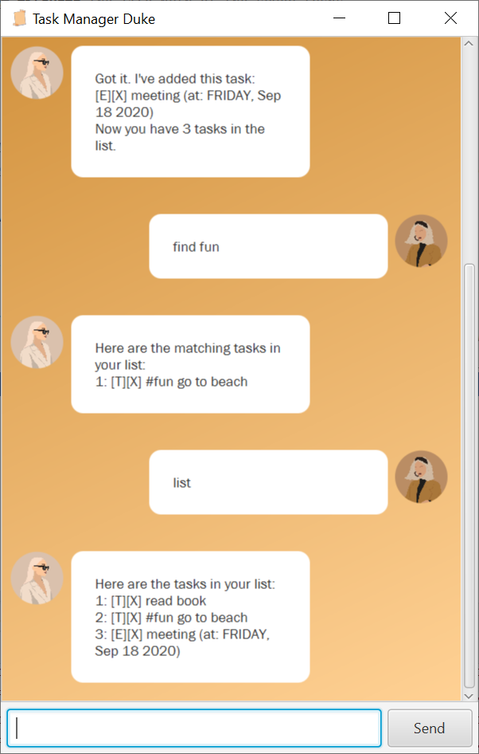

# Task Manager Duke User Guide

##Introduction
Duke is a personal chat bot that allows user to manage their tasks.
Duke is optimized for use via a Command Line Interface while still having the benefits 
of a Graphical User Interface (GUI).

##User Interface


##Quick Start
1. Make sure that you have Java 11 or above installed.
2. You can get the Task Manager Duke [here](https://github.com/luciatirta/ip/releases/tag/A-Release).
3. Download the duke.jar file.
4. Double click the file to run the Duke.
5. Type commands into the command box and click 'Send' or press Enter to execute.

## Features 
####1. Create a `todo` task
**Function:** Creates a new todo task and adds it to the list.<br/>
**Format:** `todo <description>` <br/>
**Example of usage:**
```
todo read book
```
**Expected outcome:** 
```
Got it. I've added this task:
[T][X] read book 
Now you have 1 tasks in the list.
```
####2. Create a `deadline` task
**Function:** Creates a new deadline task and adds it to the list.<br/>
**Format:** `deadline <description> /by <time>` <br/>
* If the `<time>` input is in the form YYYY-MM-DD,
it will be auto parsed into DAY, Mon DD YYYY
* Other `<time>` format will be treated as string <br />

**Example of usage:**
```
deadline submit essay /by 2020-09-18
```
**Expected outcome:** 
```
Got it. I've added this task:
[D][X] submit essay (by: FRIDAY, Sep 18 2020)
Now you have 1 tasks in the list.
```
####3. Create an `event` task
**Function:** Creates a new event task and adds it to the list.<br/>
**Format:** `event <description> /at <time>` <br/>
* If the `<time>` input is in the form YYYY-MM-DD,
it will be auto parsed into DAY, Mon DD YYYY
* Other `<time>` format will be treated as string<br/>

**Example of usage:**
```
event meeting /at 2020-09-18
```
**Expected outcome:** 
```
Got it. I've added this task:
[E][X] meeting (at: FRIDAY, Sep 18 2020)
Now you have 1 tasks in the list.
```
####4. Mark a task as `done`
**Function:** Marks the task in the list as completed.<br/>
**Format:** `done <task_index>` <br/>
**Example of usage:**
```
done 1
```
**Expected outcome:** 
```
Nice: I've marked this task as done:
[T][V] read book
```
####5. `Delete` an existing task
**Function:** Deletes a task in the list.<br/>
**Format:** `delete <task_index>` or `delete all` <br/>
**Example of usage:**
```
delete 1
```
**Expected outcome:** 
```
Noted! I've removed this task
[T][V] read book
Now you have 0 tasks in the list
```

**Example of usage:**
```
delete all
```
**Expected outcome:** 
```
Noted! I've removed all tasks in the list.
Now you have no task in the list.
```

####6. `Tag` a task
**Function:** Attaches tag(s) to a task.<br/>
**Format:** `tag <task_index> <tags>`
* The tags must be separated by commas (e.g. `fun, important, urgent`)<br />

**Example of usage:**
```
tag 1 important
```
**Expected outcome:** 
```
Noted! I've added the tag to your task.
[E][X] #important meeting (at: FRIDAY, Sep 18 2020)
```

####7. `Find` task(s) by `search_term`
**Function:** Returns all the tasks containing the `search_term` 
in the description or tag.<br/>
**Format:** `find <search_term>`
* The search term can be words from the task description or tag assigned to the task<br />

**Example of usage:**
```
find book
```
**Expected outcome:** 
```
Here are the matching tasks in your list:
1: [T][V] read book
```
**Example of usage:**
```
find important
```
**Expected outcome:** 
```
Here are the matching tasks in your list:
1: [E][X] #important meeting (at: FRIDAY, Sep 18 2020)
```
####8. `List` all tasks
**Function:** Lists all the tasks in the current list.<br/>
**Format:** `list`<br/>
**Example of usage:**
```
list
```
**Expected outcome:** 
```
Here are the tasks in your list:
1: [T][X] read book
2: [E][X] #important meeting (at: FRIDAY, Sep 18 2020)
```

####9. `Exit` the task
**Function:** Ends the chat session with Duke.<br/>
**Format:** `bye`
**Example of usage:**
```
tag 1 important
```
**Expected outcome:** 
```
Bye. See you again next time!
```


